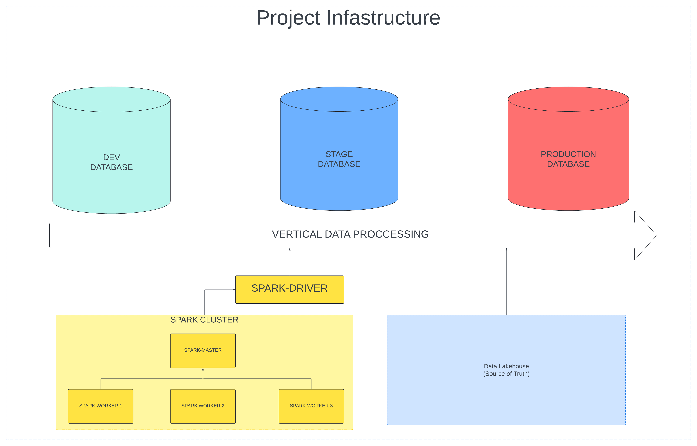
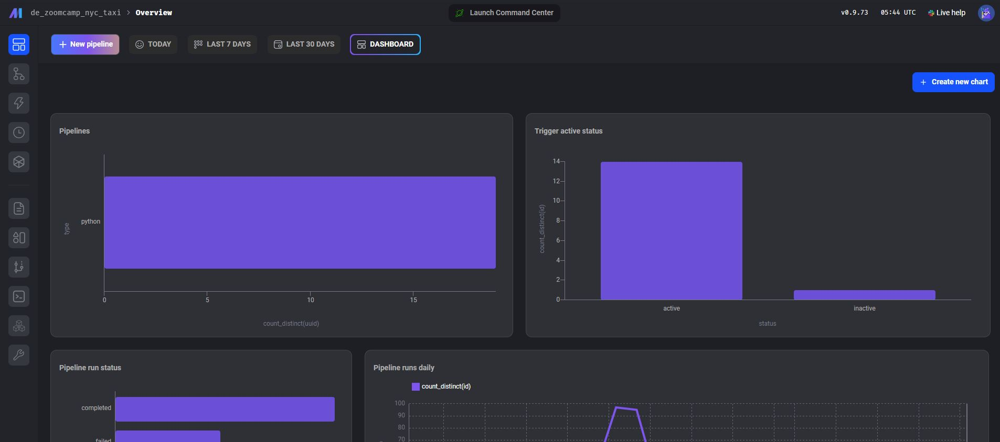
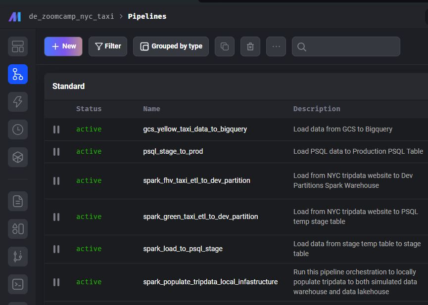
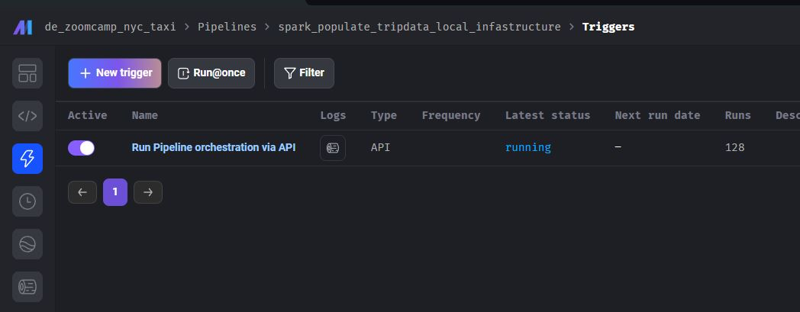
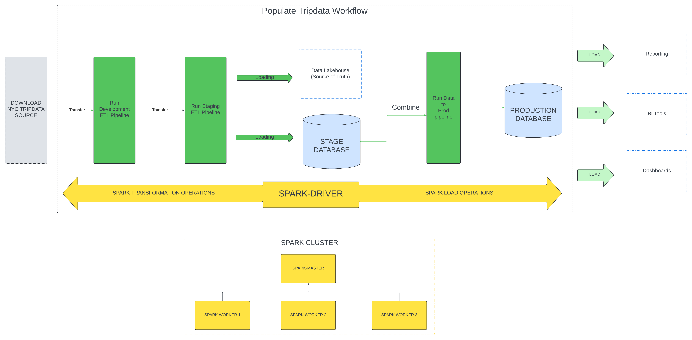
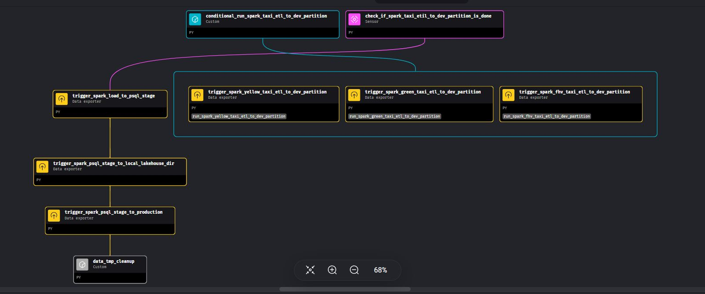
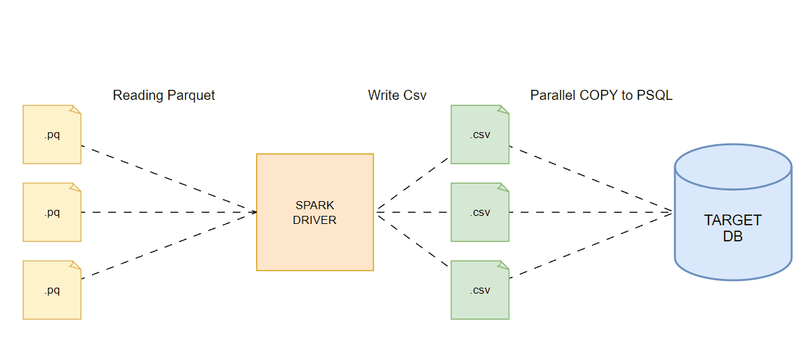
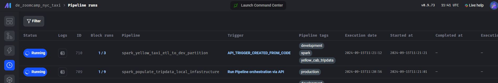
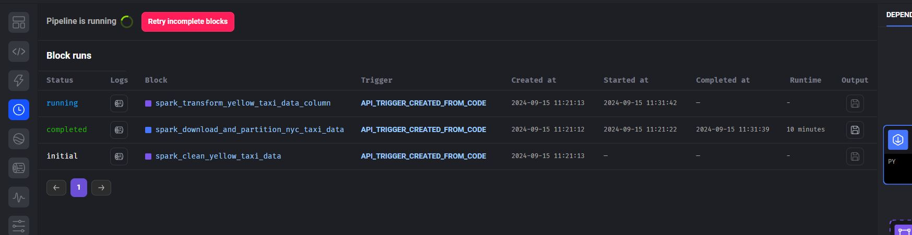
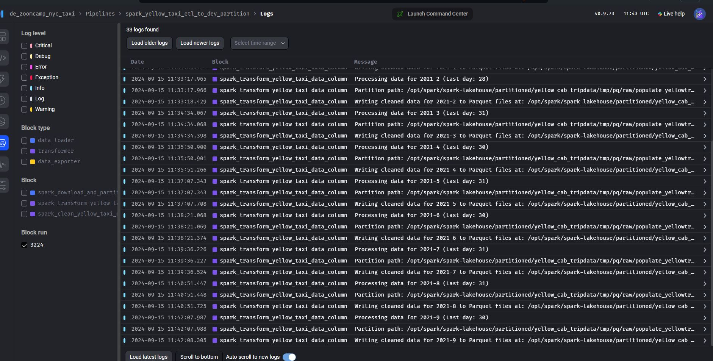

---
# Data Engineering Project: NYC Tripdata Data Infrastructure


[](https://lookerstudio.google.com/u/0/reporting/2b0189c7-098b-4a3d-b463-daa1abcf5b40/page/CWDFE)

## Table of Contents
- [About](#-about)
- [Project Infrastructure](#-project-infrastructure)
- [Dataset](#-dataset)
- [Setup](#-setup)
- [Documentation](#documentation)
- [FAQ](#FAQ)

## 🚀 About

The NYC Tripdata Project automates the process of gathering data from the NYC TLC API. The collected data is cleaned, transformed, and prepared through pipelines, producing datasets that are ready for analytics and reporting. 

Additionally, the project includes on-demand CI workflows to test and verify pipeline stability whenever there are code changes, ensuring reliable and efficient data processing.

## 🗂️ Project Infrastructure


The data processing in this project follows a **vertical pipeline** architecture with three stages:
1. **Development**: 
   - Focuses on data cleaning, transformations, and preparation of raw data.
   - Handles **specific Tripdata type modifications** and processes, ensuring that each dataset (e.g., yellow cab, green cab) is adjusted individually before moving forward.

2. **Staging**: 
   - Responsible for **data governance** and ensuring data quality.
   - Applies **global transformations** across all Tripdata types, such as adding unique identifiers (e.g., `dwid`), making data consistent and up to standard before it moves to production.

3. **Production**: 
   - The final stage where data is fully prepared for **feature extraction**, **reporting**, and **analysis**.
   - The data at this point is ready for consumption in analytical and reporting workflows.

The project leverages both **Data Lakehouse** and **Data Warehouse** concepts for effective data management:
- **Data Lakehouse**: This is where raw and intermediate data is stored. The local storage is organized under the `spark-lakehouse` directory, where temporary files, downloads, and processed trip data are housed.
- **Data Warehouse**: The processed data moves through a series of PostgreSQL databases: **dev**, **stage**, and **production**, ensuring a smooth transition across the lifecycle and enhancing governance and data management.

## 📊 Dataset
The data is sourced from the [NYC Taxi & Limousine Commission Trip Record Data](https://www.nyc.gov/site/tlc/about/tlc-trip-record-data.page). Many data engineering principles used in this project are inspired by the [DataTalksClub Data Engineering Zoomcamp](https://github.com/DataTalksClub/data-engineering-zoomcamp).

## 📝 Setup

### Prerequisites

Before running the `docker-compose up -d` command, please review the [Running on Docker](###Running-on-docker) section to modify the image resources if running on a low-end environment. Take note of the System Requirements below.

You must have the latest version of Docker and docker-compose installed. Furthermore, you also must have Postman to trigger the pipeline.

### System Requirements

| Specification       | Suggested Requirements                          | Minimum Requirements (for alternative `docker-compose`) TODO |
|---------------------|-------------------------------------------------|----------------------------------------------------------|
| **CPU**             | 6 cores, 3.5 GHz or higher                      | 3 cores                                                   |
| **RAM**             | 32 GB (16 GB allocated to Docker)               | 16 GB (8 GB allocated to Docker)                          |
| **Spark Cluster**    | 3 workers, each with 2 cores and 4 GB of RAM    | 2 workers, each with 2 cores and 2.5 GB of RAM            |
| **Storage**         | 30-50 GB                                        | 30-50 GB                                                  |


### Running Project using Docker Compose

```shell
# Open a terminal (Command Prompt or PowerShell for Windows, Terminal for macOS or Linux)

# Ensure Git is installed
# Visit https://git-scm.com to download and install console Git if not already installed

# Clone the repository
git clone https://github.com/Abblix/Oidc.Server.git](https://github.com/nimbly-dev/nyctripdata_project.git

# Navigate to the project directory
cd nyctripdata_project

# Execute this command, wait until installation is complete and after finishing it will start the server.
docker-compose up -d
```

After starting the project, navigate to [http://localhost:6789/](http://localhost:6789/). This will take you to the Mage Dashboard, where you can manage the pipelines and view data processing workflows.




## 📚 Documentation

> **Note**: This guide focuses on the usage of the project and its pipelines. For detailed information on using Mage, please refer to the [Mage documentation](https://docs.mage.ai/introduction/overview).


### Running on Docker

This project is containerized using **Docker** to simplify deployment across multiple environments. Docker allows for easy distribution and configuration management by simply editing the service declarations in the `docker-compose.yml` file.

The Docker Compose configuration sets up the following services, all connected through a shared network named **`mage-network`**:

```
├── mage_orchestrator     # Manages workflows and pipelines (Mage AI)
├── spark_master          # Master node managing the Spark cluster
│   ├── spark-worker-1    # Spark worker node 1
│   ├── spark-worker-2    # Spark worker node 2
│   ├── spark-worker-3    # Spark worker node 3
│   └── spark-history     # Spark History Server for monitoring completed jobs
├── pg_admin              # PgAdmin web UI for PostgreSQL management
├── postgres-dev          # PostgreSQL for the development environment
├── postgres-staging      # PostgreSQL for the staging environment
├── postgres-production   # PostgreSQL for the production environment
└── github-runner         # Self-hosted GitHub runner for executing workflows
```

#### Github Runner

The github runner is self-hosted. This will be run upon starting of the container using `docker-compose up -d`. For more information refer to .github/DCOUMENTATION.md. 

#### Spark Configuration

The default Spark service configuration includes the following ports:

- **Master Node**: 7077
- **Worker UI**: 7000
- **Web UI**: 9090
- **Worker Web UI**: 9091, 9092, 909* (for workers)
- **History UI**: 18080


#### Adding a New Spark Worker

If you need to add additional Spark workers to the cluster, you can easily append a new worker configuration to the `docker-compose.yml`. Below is an example configuration to add a new Spark worker:

```yaml
  spark-new-worker:
    image: cluster-apache-spark:python3.10.14-spark3.5.1
    container_name: spark-new-worker
    entrypoint: ['/bin/bash', '/start-spark.sh', 'worker']
    networks:
      - mage-network
    depends_on:
      - spark-master
    environment:
      - SPARK_MASTER=spark://spark-master:7077
      - SPARK_WORKER_CORES=2  
      - SPARK_WORKER_MEMORY=4G 
      - SPARK_WORKLOAD=worker
      - SPARK_LOCAL_IP=spark-new-worker
      - PYSPARK_PYTHON=${PYSPARK_PYTHON}
      - PYSPARK_DRIVER_PYTHON=${PYSPARK_DRIVER_PYTHON}
      - SPARK_EVENTLOG_DIR=${SPARK_EVENTLOG_DIR}
      - SPARK_HISTORY_DIR=${SPARK_HISTORY_DIR}
      - SPARK_WAREHOUSE_DIR=${SPARK_WAREHOUSE_DIR}
      - SPARK_LAKEHOUSE_DIR=${SPARK_LAKEHOUSE_DIR}
      - SPARK_CHECKPOINT_DIR=${SPARK_CHECKPOINT_DIR}
      - SPARK_LOCAL_DIR=${SPARK_LOCAL_DIR}
    volumes:
      - spark-home:/opt/spark
      - ./spark-data:/opt/spark/work
    ports:
      - "{CHANGE_PORT_HERE}:8081"  # Change this port to avoid conflicts
    deploy:
      resources:
        limits:
          cpus: "2"
          memory: "4G"
```


#### Database Configurations

The following are the default hostname and ports of our Postgres databases.

| Database Name               | Hostname            | Port  |
|-----------------------------|---------------------|-------|
| **nyc_taxi_dev_postgres**    | `postgres-dev`      | 5432  |
| **nyc_taxi_staging_postgres**| `postgres-staging`  | 5433  |
| **nyc_taxi_production_postgres** | `postgres-production` | 5434  |

Furthermore, these are the service account users that are used by the pipeline in order to query with the databases

| Environment | Service Account Email | Database Name | Role (Privileges) |
|-------------|-----------------------|---------------|-------------------|
| Development | `dev-service-account@de-nyctripdata-project.iam.com` | `nyc_taxi_dev_postgres` | - **SELECT**, **INSERT**, **UPDATE**, **DELETE** on all tables in `public` and `temp` schemas<br>- **CREATE** on `public` and `temp` schemas<br>- **USAGE**, **SELECT** on all sequences in `public` and `temp` schemas |
| Staging | `staging-service-account@de-nyctripdata-project.iam.com` | `nyc_taxi_staging_postgres` | - **SELECT**, **INSERT**, **UPDATE**, **DELETE** on all tables in `public` and `temp` schemas<br>- **CREATE** on `public` and `temp` schemas<br>- **USAGE**, **SELECT** on all sequences in `public` and `temp` schemas |
| Production | `production-service-account@de-nyctripdata-project.iam.com` | `nyc_taxi_production_postgres` | - **SELECT**, **INSERT**, **UPDATE**, **DELETE** on all tables in `public` and `temp` schemas<br>- **CREATE** on `public` and `temp` schemas<br>- **USAGE**, **SELECT** on all sequences in `public` and `temp` schemas |


#### Populating the Databases with Tripdata

To populate the databases with NYC trip data, you can use the **spark_populate_tripdata_local_infrastructure** pipeline. This pipeline orchestrates various stages, transforming raw trip data into production-ready formats to be stored in both the Data Warehouse and Data Lakehouse.


### Getting Started with the Pipeline

1. **Navigate to the Pipelines**:  
   From the Mage Dashboard, click on **Pipelines** in the left-side panel. Then, select the **spark_populate_tripdata_local_infrastructure** pipeline to proceed.

   

2. **Trigger the Pipeline**:  
   On the pipeline page, navigate to **Trigger** in the left-side panel. Click on the **Run Pipeline orchestration via API** hyperlink to open the pipeline's trigger endpoint.

   

3. **Execute the Pipeline via API**:  
   Copy the API URL provided and use a tool like Postman to execute the pipeline.

   


#### Example API Request Body

Here’s an example request body that you can use in Postman to run the pipeline:

```json
{
  "pipeline_run": {
    "variables": {
      "dev_limit_rows" : -1,
      "end_month": 12,
      "end_year": 2021,
      "start_month": 1,
      "start_year": 2021,
      "pipeline_run_name": "populate_fhvtripdata_2022",
      "spark_mode" : "cluster",
      "tripdata_type": "fhv_cab_tripdata",
      "data_loss_threshold": "very_strict",
      "is_overwrite_enabled": true
    }
  }
}
```

- **dev_limit_rows**: Set to `-1` to process all rows, or limit the number of rows for testing.
- **start_year / start_month**: Specify the start period for the trip data.
- **end_year / end_month**: Specify the end period for the trip data.
- **pipeline_run_name**: A custom name for the pipeline run.
- **spark_mode**: Choose the Spark execution mode, e.g., `local` or `cluster`.
- **tripdata_type**: The type of trip data to process (e.g., `fhv_cab_tripdata`).
- **data_loss_threshold**: Set to `"very_strict"` for strict error handling during data processing.

Once you send the request, the pipeline will begin processing the data as per the parameters you provided.


#### API Request Body Parameters

| Parameter             | Description                                                                                                                                                            | Example Value                       |
|-----------------------|------------------------------------------------------------------------------------------------------------------------------------------------------------------------|-------------------------------------|
| **dev_limit_rows**     | Limit the number of rows for testing. Set to `-1` to process all rows.                                                                                                  | `-1` (process all rows)             |
| **start_year**         | The start year of the trip data to be processed.                                                                                                                        | `2021`                              |
| **start_month**        | The start month of the trip data to be processed.                                                                                                                       | `1` (for January)                   |
| **end_year**           | The end year of the trip data to be processed.                                                                                                                          | `2021`                              |
| **end_month**          | The end month of the trip data to be processed.                                                                                                                         | `12` (for December)                 |
| **pipeline_run_name**  | A custom name for the pipeline run, useful for tracking multiple runs.                                                                                                  | `"populate_fhvtripdata_2022"`       |
| **spark_mode**         | The execution mode for Spark. Set to `"local"` for local execution or `"cluster"` for distributed execution.                                                            | `"cluster"`                         |
| **tripdata_type**      | Specifies the type of trip data to be processed. Possible values: `"yellow_cab_tripdata"`, `"green_cab_tripdata"`, `"fhv_cab_tripdata"`.                                 | `"fhv_cab_tripdata"`                |
| **data_loss_threshold**| Specifies the acceptable level of data loss during processing. Possible values: `"very_strict"` (1% loss), `"strict"` (5% loss), `"moderate"` (10% loss).                | `"very_strict"`                     |
| **is_overwrite_enabled**| Specifies if either to overwrite or update existing data on the PSQL data-warehouse.                                                                                   | `"true"`                     |

**Explanation of Key Parameters:**
- **tripdata_type**: Choose between `yellow_cab_tripdata`, `green_cab_tripdata`, or `fhv_cab_tripdata` based on the dataset you want to process.
- **data_loss_threshold**: Defines how much data loss is acceptable during the data processing pipeline. Here’s how the thresholds break down:
  - `"very_strict"`: Maximum data loss of **1%**.
  - `"strict"`: Maximum data loss of **5%**.
  - `"moderate"`: Maximum data loss of **10%**.

 
### Structure of the Populate Tripdata Pipeline 



This diagram is the overview of the Pipeline Orchestration. This follows the Data Proccessing stages that we mentioned on the Project description.

The following is the Pipelines being run by this pipeline Orchestration

```
├── conditional_run_spark_taxi_etl_to_dev_partition # Run Pipeline based on tripdata
├───spark_yellow_taxi_etl_to_dev_partition
├───spark_green_taxi_etl_to_dev_partition
├───spark_fhv_taxi_etl_to_dev_partition
├── check_if_spark_taxi_etil_to_dev_partition_is_done # Run Pipeline based on tripdata
├───spark_load_to_psql_stage
├───spark_psql_stage_to_local_lakehouse_dir
├───spark_psql_stage_to_production
├───data_tmp_cleanup
```

#### Populate Infra Tripdata Pipelines



The `Populate Infra Tripdata Pipelines` workflow is a series of pipelines that automate the processing of NYC trip data from downloading to production. Each pipeline performs specific tasks to ensure data is correctly processed, cleaned, and loaded into PostgreSQL and the Lakehouse storage.


##### 1. **`spark_taxi_etil_to_dev_partition` Pipeline**

This pipeline is responsible for preparing the trip data for further processing:

- Downloads raw trip data from the NYC Tripdata website.
- Transforms columns by converting data types and renaming columns as necessary.
- Cleans the data for quality assurance.
- Writes the cleaned data to a temporary Parquet directory in the **dev** environment.


##### 2. **`spark_load_to_psql_stage` Pipeline**

This pipeline loads the cleaned trip data into the **staging** PostgreSQL table using an upsert strategy:

- Ingests the cleaned data from the **dev** Parquet directory.
- Runs an additional cleaning process on the data.
- Adds a **dwid** (primary key) to each record in the trip data.
- Appends the data to the **staging** trip data table using an **overwrite** or **upsert** strategy:
  - Writes temporary .csv files that will be copied to the staging table.
  - If overwrite is enabled. It will truncate the selected partitoned table first, and then parallelly copy the csv to the stage table
  - If overwrite is disabled. It will create a temporary table first, and then the temporary table will be populated by parallel PSQL copy command. Finally, we will insert the data using Upsert strategy.

Overwrite Workflow: 



##### 3. **`spark_psql_stage_to_local_lakehouse_dir` Pipeline**

This pipeline moves the trip data from the **staging** PostgreSQL table to the local Lakehouse directory:

- Extracts the data from the **staging** trip data table.
- Writes the data to a **pre-lakehouse** temporary Parquet directory.
- Writes the final data to the **Lakehouse** directory at `/opt/spark/spark-lakehouse/partitioned/{tripdata_type}/data` in Parquet format.


##### 4. **`spark_psql_stage_to_production` Pipeline**

This pipeline transfers data from the **Lakehouse** and **staging** environments to the **production** PostgreSQL table:

- Reads data from both the **Lakehouse** and the **staging** table, writing them into temporary directories.
- Join the two datasets, treating the **Lakehouse** as the source of truth.
- Applies a basic cleaning process to the combined dataset.
- Loads the cleaned and combined data into the **production** trip data table using an **upsert** or **overwrite** strategy similar to the one used in the `spark_load_to_psql_stage` pipeline.


### Tripdata Tables

When using Docker Compose, partitioned **Tripdata** tables will be created without data. A series of SQL queries will be executed, and you can review these queries in the deployment folder. The project includes three types of datasets:

| Dataset         | Description                               | Data Dictionary                                                   |
|-----------------|-------------------------------------------|-------------------------------------------------------------------|
| **Yellow Tripdata**  | Data containing trip records for Yellow Cab taxis. | [Yellow Tripdata Dictionary](https://www.nyc.gov/assets/tlc/downloads/pdf/data_dictionary_trip_records_yellow.pdf) |
| **Green Tripdata**   | Data containing trip records for Green Cab taxis.  | [Green Tripdata Dictionary](https://www.nyc.gov/assets/tlc/downloads/pdf/data_dictionary_trip_records_green.pdf)  |
| **FHV Tripdata**     | Data containing trip records for For-Hire Vehicles. | [FHV Tripdata Dictionary](https://www.nyc.gov/assets/tlc/downloads/pdf/data_dictionary_trip_records_fhv.pdf)    |

#### `dwid` Column

The `dwid` column is added at the stage level and is used as a primary key in various Trip datasets. It is generated by hashing a concatenation of common columns (`pickup_datetime`, `dropoff_datetime`, `pu_location_id`, and `do_location_id`) using the SHA-256 algorithm. 

Key Points:
- **Uniqueness**: The `dwid` is designed to be unique and deterministic. It is not random but derived from consistent values in the common columns.
- **Deterministic Nature**: This ensures that the `dwid` remains consistent even if the data pipeline is run multiple times. This deterministic approach supports reliable upserts (updates and inserts) without duplication.

By generating a `dwid` based on these key columns, we ensure consistent and unique identification across datasets, this also allows us to do an **upsert** operation whenever needed using this column.

#### Partitioning in the Tripdata Tables

When data is appended to Tripdata tables, the pipeline creates a partition based on the month extracted from `pickup_datetime`. Each partition corresponds to a specific month. Data is inserted into the appropriate partition after creation.

A SQL function available in all public schemas automates this process. It takes the table name and target date in datetime format, creating a partition named: {tripdata_table_name}{environment}{year}_{month}. The default partition key is `pickup_datetime`.


### Modifying the Pipeline

When modifying the pipeline, consider the following guidelines:

- **Development Stage**: Apply specific changes such as column transformations, new cleaning rules, or additional data to the development pipeline (e.g., `spark_yellow_taxi_etl_to_dev_partition`). This stage is intended for testing changes specific to a Tripdata type.

- **Stage Level**: Use this stage for ensuring data integrity, adding columns present across datasets, and pre-production data cleaning and transformation. It is suitable for global changes that affect all Tripdata types.

- **Production Level**: Make minimal changes here. This stage combines lakehouse data and stage data to maintain data integrity. Include only dynamic cleaning operations. Avoid column transformations at this level; these should be handled in the Stage level for global changes or the Development stage for specific changes.

### Monitoring Pipelines

You can monitor the progress of your pipeline directly in the Mage app. Navigate to [http://localhost:6789/pipelines](http://localhost:6789/pipelines) to view the pipeline status.

If the pipeline fails, you can investigate the issue by selecting the pipeline detail and reviewing the logs. You can also re-run the pipeline if necessary.



Clicking on a specific pipeline will display the individual code blocks that are executed as part of the pipeline:



To view real-time logs or troubleshoot errors, click the logs icon, which provides a live tail of the pipeline’s execution:



Here’s an improved version of your **FAQ** section with clearer formatting, grammar, and readability, while maintaining the same core message:


## ❓ FAQ

### 1. What is the purpose/goal of this project?

The primary goal of this project is to automate the process of retrieving TLC Trip Data from the API, cleaning and transforming it, and ingesting it for reporting and analysis. Over time, the scope was expanded to include technologies like `Apache Spark` to efficiently handle and process large datasets.

The concept of pipeline stages in this project was inspired by my experience as a Software Engineer, where applications are deployed across multiple environments, such as Development for early-stage features and Production for stable, end-user-ready products.

Additionally, I enhanced the project by:
- Creating a Fact pipeline and dashboards to derive insights.
- Adding GitHub Workflows to ensure pipeline stability by testing changes before they are applied.

While these extensions helped me explore and learn new technologies and tools, the core purpose was successfully achieved: building an ETL pipeline to automate data gathering, cleaning, transformation, and delivery of ready-to-use NYC TLC Trip datasets.

### 2. Why use this dataset and not others?

This dataset was introduced to me through the [DataTalksClub Data Engineering Zoomcamp](https://github.com/DataTalksClub/data-engineering-zoomcamp), which I followed up to the Apache Spark section before branching off to build my own ETL pipelines and add new features.

The dataset is large, with the `yellow_tripdata` as one year having 32 million records, making it ideal for leveraging Spark to distribute workloads effectively. This presented a valuable challenge, as an inefficient ETL process could easily overwhelm the system, requiring careful optimization.

While the dataset focuses on NYC taxi trips—less relevant outside the transportation industry—it offers meaningful insights for anyone researching or analyzing taxi patterns in New York City.

### 3. I have this 'X' issue?

Known issues are documented in the Issues tab, and some include workarounds that can be used until they are resolved. After STABLE_RELEASE_1, I may not actively track or maintain issues unless they are critical.

Moving forward, my focus will shift to the next phase of the project, which is a potential cloud migration.

### 4. Can you migrate this to the cloud? 

I plan to start with a Proof of Concept (PoC) that outlines the necessary services for migration, replacements (e.g., Self-Hosted Apache Spark with AWS EMR), and the overall architecture.

The PoC will utilize Free Tier AWS Services wherever possible and will be documented in this repository, likely as a README.md file with an accompanying architecture diagram. The actual cloud migration project will be hosted in a separate repository and will primarily include Terraform code, detailed steps, and supporting documentation.
