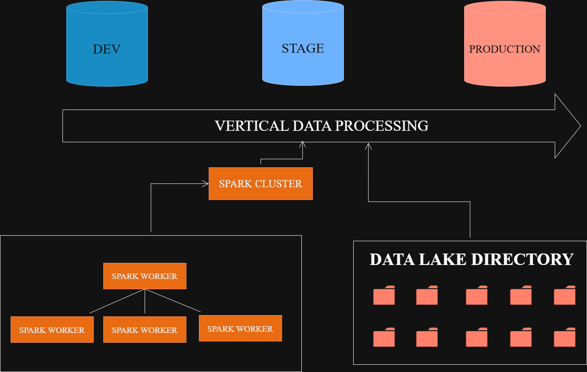

---
# Data Engineering Project: NYC Tripdata Data Infrastructure

## Table of Contents
- [About](#-about)
- [Project Infrastructure](#-project-infrastructure)
- [Dataset](#-dataset)
- [Setup](#-setup)
- [Documentation](#documentation)
- [FAQ](#FAQ)

## 🚀 About

The **NYC Tripdata Project** automates the process of collecting data from the NYC TLC API. The collected data is then cleaned, transformed, and prepared through pipelines, resulting in datasets that are ready for analysis and reporting.

This project is divided into two main workflows:

1. **ETL Pipeline**: This workflow is responsible for extracting raw data, transforming it, and preparing it for the analytical workflow. It leverages **Apache Spark** to efficiently process and transform millions of lines of data.

2. **Analytical Workflow**: Using the data prepared by the Spark workflow, this workflow utilizes **dbt-core** to create fact and dimension tables for reporting and analytics.

For more detailed information, refer to the [wiki](documentation/two-workflows.md).

## 🗂️ Project Infrastructure

The data processing in this project follows a **vertical pipeline** architecture with three stages:
1. **Development**: 
   - Focuses on data cleaning, transformations, and preparation of raw data.
   - Handles **specific Tripdata type modifications** and processes, ensuring that each dataset (e.g., yellow cab, green cab) is adjusted individually before moving forward.

2. **Staging**: 
   - Responsible for **data governance** and ensuring data quality.
   - Applies **global transformations** across all Tripdata types, such as adding unique identifiers (e.g., `dwid`), making data consistent and up to standard before it moves to production.

3. **Production**: 
   - The final stage where data is fully prepared for **feature extraction**, **reporting**, and **analysis**.
   - The data at this point is ready for consumption in analytical and reporting workflows.

The project leverages both **Data Lake** and **Data Warehouse** concepts for effective data management:
- **Data Lake**: This is where raw and intermediate data is stored. The local storage is organized under the `spark-lakehouse` directory, where temporary files, downloads, and processed trip data are housed.
- **Data Warehouse**: The processed data moves through a series of PostgreSQL databases: **dev**, **stage**, and **production**, ensuring a smooth transition across the lifecycle and enhancing governance and data management.

## 📊 Dataset
The data is sourced from the [NYC Taxi & Limousine Commission Trip Record Data](https://www.nyc.gov/site/tlc/about/tlc-trip-record-data.page). Many data engineering principles used in this project are inspired by the [DataTalksClub Data Engineering Zoomcamp](https://github.com/DataTalksClub/data-engineering-zoomcamp).

## 📝 Setup

To begin using the project, you'll need to have **Docker** installed on your Windows machine. For a step-by-step guide on how to set up Docker, please refer to the [setup documentation](documentation/setup.md).

## 📚 Documentation

> **Note**: This guide provides instructions on how to use the project and its associated pipelines. For comprehensive information about using Mage, please refer to the [Mage documentation](https://docs.mage.ai/introduction/overview).

For details on the project's **Docker configuration** and the **image services** used, please refer to the [Docker documentation](documentation/documentation-docker.md).

To learn more about the usage of the **ETL Spark pipeline**, check out the [Spark ETL Pipeline documentation](documentation/documentation_spark_etl_pipeline.md).

For an overview of the **General Tripdata** and its tables, refer to the [Tripdata Tables documentation](documentation/documentation_tripdata_tables.md).

## ❓ FAQ

### 1. What is the purpose/goal of this project?

The primary goal of this project is to automate the process of retrieving TLC Trip Data from the API, cleaning and transforming it, and ingesting it for reporting and analysis. Over time, the scope was expanded to include technologies like `Apache Spark` to efficiently handle and process large datasets.

The concept of pipeline stages in this project was inspired by my experience as a Software Engineer, where applications are deployed across multiple environments, such as Development for early-stage features and Production for stable, end-user-ready products.

Additionally, I enhanced the project by:
- Creating a Fact pipeline and dashboards to derive insights.
- Adding GitHub Workflows to ensure pipeline stability by testing changes before they are applied.

While these extensions helped me explore and learn new technologies and tools, the core purpose was successfully achieved: building an ETL pipeline to automate data gathering, cleaning, transformation, and delivery of ready-to-use NYC TLC Trip datasets.

### 2. Why use this dataset and not others?

This dataset was introduced to me through the [DataTalksClub Data Engineering Zoomcamp](https://github.com/DataTalksClub/data-engineering-zoomcamp), which I followed up to the Apache Spark section before branching off to build my own ETL pipelines and add new features.

The dataset is large, with the `yellow_tripdata` as one year having 32 million records, making it ideal for leveraging Spark to distribute workloads effectively. This presented a valuable challenge, as an inefficient ETL process could easily overwhelm the system, requiring careful optimization.

While the dataset focuses on NYC taxi trips—less relevant outside the transportation industry—it offers meaningful insights for anyone researching or analyzing taxi patterns in New York City.

### 3. I have this 'X' issue?

Known issues are documented in the Issues tab, and some include workarounds that can be used until they are resolved. After STABLE_RELEASE_1, I may not actively track or maintain issues unless they are critical.

Moving forward, my focus will shift to the next phase of the project, which is a potential cloud migration.

### 4. Can you migrate this to the cloud? 

I plan to start with a Proof of Concept (PoC) that outlines the necessary services for migration, replacements (e.g., Self-Hosted Apache Spark with AWS EMR), and the overall architecture.

The PoC will utilize Free Tier AWS Services wherever possible and will be documented in this repository, likely as a README.md file with an accompanying architecture diagram. The actual cloud migration project will be hosted in a separate repository and will primarily include Terraform code, detailed steps, and supporting documentation.
