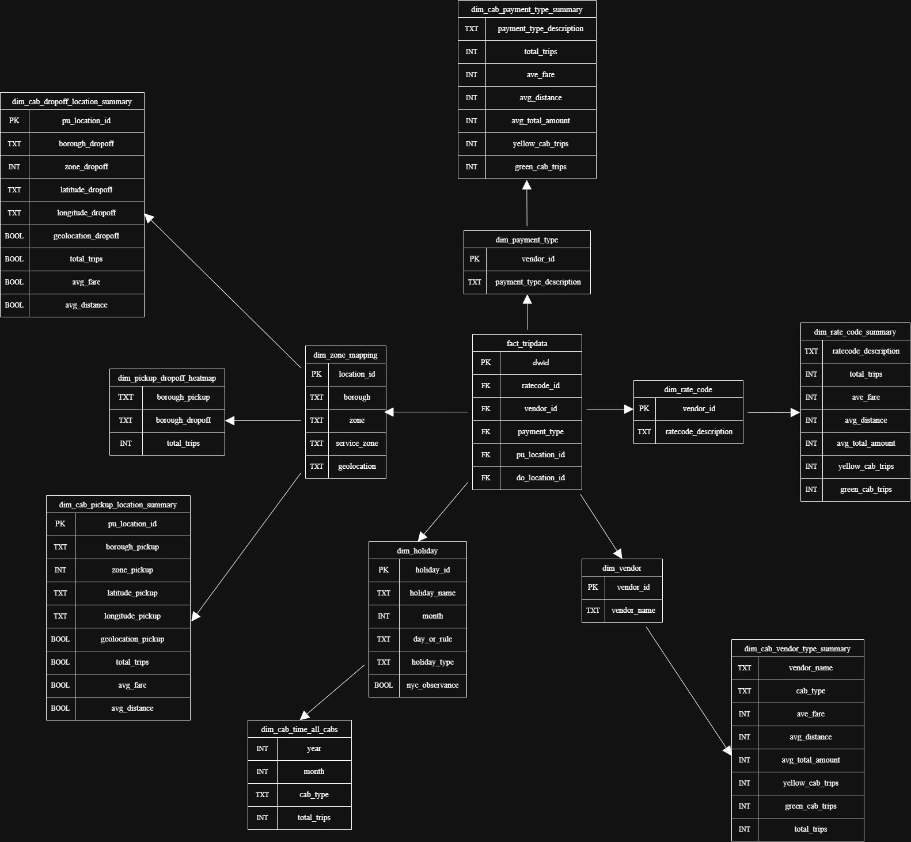

# DBT Fact & Dimension Tables Documentation



## Overview  

This project follows a **Snowflake Schema** to structure NYC taxi trip data efficiently. The schema consists of:  

1. **Fact Table (`fact_tripdata`)** – Stores transactional records of taxi trips.  
2. **Dimension Tables (Seeded Data)** – Provide reference data for categorical fields.  
3. **Aggregated Tables** – Precomputed summaries for optimized analytical queries.  

## Snowflake Schema Structure  

### **1. Fact Table: `fact_tripdata`**  
The core transactional table containing NYC taxi trip data. This data is extracted, cleaned, and transformed from raw datasets using the **ETL Spark Pipeline**.  

#### **Key Attributes**  
- **Primary Key:** `dwid` (Unique trip identifier).  
- **Foreign Keys:**  
  - `vendor_id` → `dim_vendor` (Maps to vendor details).  
  - `ratecode_id` → `dim_rate_code` (Maps to rate code descriptions).  
  - `payment_type` → `dim_payment_type` (Maps to payment method descriptions).  
  - `pu_location_id`, `do_location_id` → `dim_zone_mapping` (Maps to geographic zones).  
- **Metrics:** Fare amount, total amount, trip distance, timestamps.  

### **2. Dimension Tables (Seeded Data)**  
Dimension tables provide categorical mappings for `fact_tripdata`. These are static datasets that ensure data consistency and reduce redundancy.  

#### **Seeded Dimension Tables**  
| Table Name              | Purpose |
|-------------------------|---------|
| `dim_vendor`           | Maps `vendor_id` to vendor names. |
| `dim_payment_type`     | Maps `payment_type` to payment descriptions. |
| `dim_rate_code`        | Defines rate code classifications. |
| `dim_zone_mapping`     | Maps pickup and dropoff locations to NYC taxi zones. |
| `dim_holiday`          | Contains holiday data for time-based analysis. |

### **3. Aggregated Tables (2nd Stage Processing)**  
Precomputed summary tables derived from `fact_tripdata` and dimension tables. These tables improve query performance by reducing the need for frequent joins and calculations.  

| Table Name                      | Purpose |
|----------------------------------|---------|
| `dim_cab_payment_type_summary` | Summarizes trips by payment type. |
| `dim_rate_code_summary`        | Aggregates trip data by rate code. |
| `dim_cab_vendor_type_summary`  | Provides trip metrics per vendor. |
| `dim_cab_time_all_cabs`        | Tracks trip frequency over time. |
| `dim_cab_pickup_location_summary` | Analyzes trip counts by pickup location. |
| `dim_cab_dropoff_location_summary` | Analyzes trip counts by dropoff location. |

## dbt Seeds and Processing  

The dimension tables are stored as **dbt seeds**, ensuring consistency and easy maintenance. These are loaded into the database before processing `fact_tripdata`.  

To load seed data, run:  
```sh
dbt seed --select dim_vendor dim_payment_type dim_rate_code dim_zone_mapping dim_holiday
