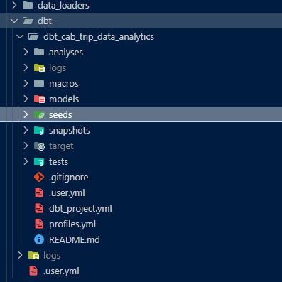
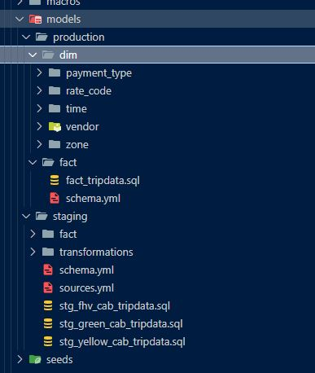
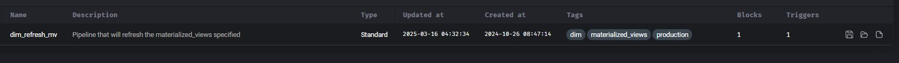

# **DBT Workflow Pipeline Documentation**

## **Overview**  

This project includes a **dbt workflow** housed in the `dbt_cab_trip_data_analytics` project. The primary purpose of this workflow is to **generate fact and dimension tables** from the cleaned and transformed trip data produced by the **ETL Spark Pipeline**.



## **Database & Profiles**  

The dbt workflow operates on **two databases**:  
- **`stage`** – Used for intermediary transformations and testing.  
- **`production`** – Stores final production-ready tables.  

The dbt project includes **two execution profiles**:  
1. **Production** – Runs dbt models in the `production` database.  
2. **Staging** – Runs dbt models in the `stage` database.  

The project structure also reflects this separation, with models divided into `production` and `stage` folders.



## **Running the dbt Workflow**  

To populate the **fact_tripdata** table, the following dbt pipeline orchestrates the models:


A **sample pipeline execution** looks like this:  

```json
{
  "pipeline_run": {
    "variables": {
        "start_month": 12,
        "start_year": 2021,
        "end_month": 1,
        "end_year": 2022,
        "env_to_populate": "production",
        "get_data_from": "['green','yellow','fhv']"
    }
  }
}
```

### **Configuration Parameters**  
- `"env_to_populate": "production"` → Defines whether to populate `production` or `stage`.  
- `"get_data_from": "['green','yellow','fhv']"` → **(Currently ignored)**. The pipeline fetches **all data** regardless of this setting.  

---

## **Populating Dimension Tables**  

To refresh and populate **dimension tables**, run the **dimension pipeline**:



This process ensures that all static **reference data** (vendors, payment types, rate codes, etc.) is available for analytics.

---

## **Schema Breakdown**  

The project’s **dbt models** are organized into **three main schemas** based on function:

### **1. Staging Database (`stage`)**  
| Schema | Purpose |
|--------|---------|
| `staging` | Contains **raw** staging tables (`stg_green`, `stg_yellow`, `stg_fhv`). |
| `staging_fact` | Holds **transformed** staging fact data (`stg_fact_tripdata`). |

### **2. Production Database (`production`)**  
| Schema | Purpose |
|--------|---------|
| `production` | **Currently empty** (reserved for general data). |
| `production_fact` | Stores **final** `fact_tripdata` table for analytics. |
| `production_dim` | Contains **dimension tables** for reference data. |
