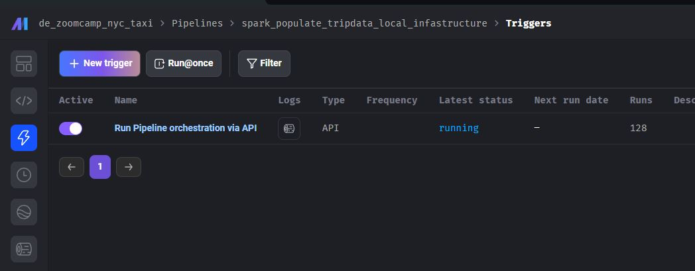
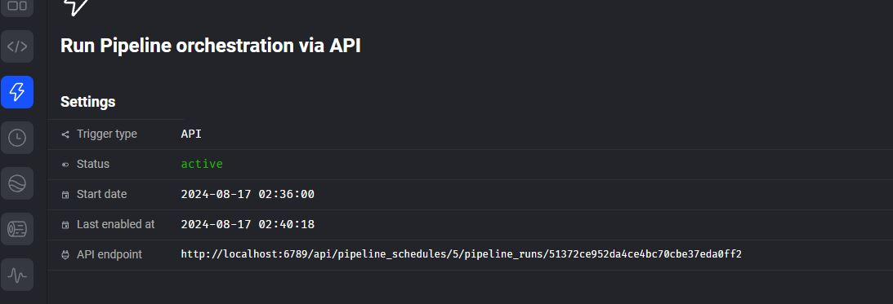
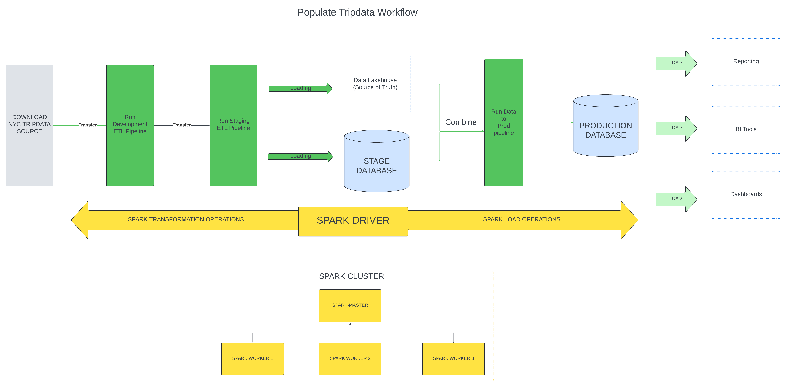
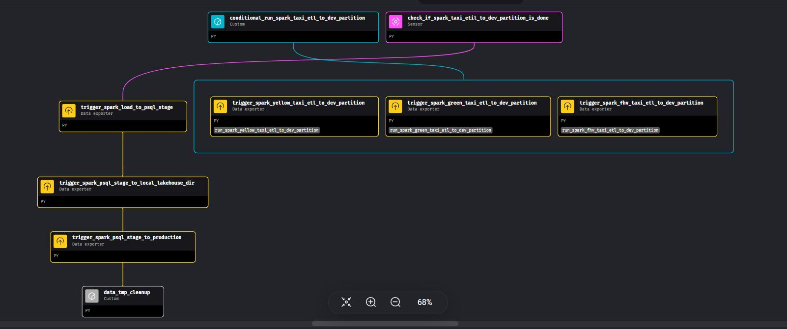

#### Populating the Databases with Tripdata

To populate the databases with NYC trip data, you can use the **spark_populate_tripdata_local_infrastructure** pipeline. This pipeline orchestrates various stages, transforming raw trip data into production-ready formats to be stored in both the Data Warehouse and Data Lakehouse.


### Getting Started with the Pipeline

1. **Navigate to the Pipelines**:  
   From the Mage Dashboard, click on **Pipelines** in the left-side panel. Then, select the **spark_populate_tripdata_local_infrastructure** pipeline to proceed.

   

2. **Trigger the Pipeline**:  
   On the pipeline page, navigate to **Trigger** in the left-side panel. Click on the **Run Pipeline orchestration via API** hyperlink to open the pipeline's trigger endpoint.

   

3. **Execute the Pipeline via API**:  
   Copy the API URL provided and use a tool like Postman to execute the pipeline.

   


#### Example API Request Body

Here’s an example request body that you can use in Postman to run the pipeline:

```json
{
  "pipeline_run": {
    "variables": {
      "dev_limit_rows" : -1,
      "end_month": 12,
      "end_year": 2021,
      "start_month": 1,
      "start_year": 2021,
      "pipeline_run_name": "populate_fhvtripdata_2022",
      "spark_mode" : "cluster",
      "tripdata_type": "fhv_cab_tripdata",
      "data_loss_threshold": "very_strict",
      "is_overwrite_enabled": true
    }
  }
}
```

- **dev_limit_rows**: Set to `-1` to process all rows, or limit the number of rows for testing.
- **start_year / start_month**: Specify the start period for the trip data.
- **end_year / end_month**: Specify the end period for the trip data.
- **pipeline_run_name**: A custom name for the pipeline run.
- **spark_mode**: Choose the Spark execution mode, e.g., `local` or `cluster`.
- **tripdata_type**: The type of trip data to process (e.g., `fhv_cab_tripdata`).
- **data_loss_threshold**: Set to `"very_strict"` for strict error handling during data processing.

Once you send the request, the pipeline will begin processing the data as per the parameters you provided.


#### API Request Body Parameters

| Parameter             | Description                                                                                                                                                            | Example Value                       |
|-----------------------|------------------------------------------------------------------------------------------------------------------------------------------------------------------------|-------------------------------------|
| **dev_limit_rows**     | Limit the number of rows for testing. Set to `-1` to process all rows.                                                                                                  | `-1` (process all rows)             |
| **start_year**         | The start year of the trip data to be processed.                                                                                                                        | `2021`                              |
| **start_month**        | The start month of the trip data to be processed.                                                                                                                       | `1` (for January)                   |
| **end_year**           | The end year of the trip data to be processed.                                                                                                                          | `2021`                              |
| **end_month**          | The end month of the trip data to be processed.                                                                                                                         | `12` (for December)                 |
| **pipeline_run_name**  | A custom name for the pipeline run, useful for tracking multiple runs.                                                                                                  | `"populate_fhvtripdata_2022"`       |
| **spark_mode**         | The execution mode for Spark. Set to `"local"` for local execution or `"cluster"` for distributed execution.                                                            | `"cluster"`                         |
| **tripdata_type**      | Specifies the type of trip data to be processed. Possible values: `"yellow_cab_tripdata"`, `"green_cab_tripdata"`, `"fhv_cab_tripdata"`.                                 | `"fhv_cab_tripdata"`                |
| **data_loss_threshold**| Specifies the acceptable level of data loss during processing. Possible values: `"very_strict"` (1% loss), `"strict"` (5% loss), `"moderate"` (10% loss).                | `"very_strict"`                     |
| **is_overwrite_enabled**| Specifies if either to overwrite or update existing data on the PSQL data-warehouse.                                                                                   | `"true"`                     |

**Explanation of Key Parameters:**
- **tripdata_type**: Choose between `yellow_cab_tripdata`, `green_cab_tripdata`, or `fhv_cab_tripdata` based on the dataset you want to process.
- **data_loss_threshold**: Defines how much data loss is acceptable during the data processing pipeline. Here’s how the thresholds break down:
  - `"very_strict"`: Maximum data loss of **1%**.
  - `"strict"`: Maximum data loss of **5%**.
  - `"moderate"`: Maximum data loss of **10%**.

 
### Structure of the Populate Tripdata Pipeline 



This diagram is the overview of the Pipeline Orchestration. This follows the Data Proccessing stages that we mentioned on the Project description.

The following is the Pipelines being run by this pipeline Orchestration

```
├── conditional_run_spark_taxi_etl_to_dev_partition # Run Pipeline based on tripdata
├───spark_yellow_taxi_etl_to_dev_partition
├───spark_green_taxi_etl_to_dev_partition
├───spark_fhv_taxi_etl_to_dev_partition
├── check_if_spark_taxi_etil_to_dev_partition_is_done # Run Pipeline based on tripdata
├───spark_load_to_psql_stage
├───spark_psql_stage_to_local_lakehouse_dir
├───spark_psql_stage_to_production
├───data_tmp_cleanup
```

#### Populate Infra Tripdata Pipelines



The `Populate Infra Tripdata Pipelines` workflow is a series of pipelines that automate the processing of NYC trip data from downloading to production. Each pipeline performs specific tasks to ensure data is correctly processed, cleaned, and loaded into PostgreSQL and the Lakehouse storage.


##### 1. **`spark_taxi_etil_to_dev_partition` Pipeline**

This pipeline is responsible for preparing the trip data for further processing:

- Downloads raw trip data from the NYC Tripdata website.
- Transforms columns by converting data types and renaming columns as necessary.
- Cleans the data for quality assurance.
- Writes the cleaned data to a temporary Parquet directory in the **dev** environment.


##### 2. **`spark_load_to_psql_stage` Pipeline**

This pipeline loads the cleaned trip data into the **staging** PostgreSQL table using an upsert strategy:

- Ingests the cleaned data from the **dev** Parquet directory.
- Runs an additional cleaning process on the data.
- Adds a **dwid** (primary key) to each record in the trip data.
- Appends the data to the **staging** trip data table using an **overwrite** or **upsert** strategy:
  - Writes temporary .csv files that will be copied to the staging table.
  - If overwrite is enabled. It will truncate the selected partitoned table first, and then parallelly copy the csv to the stage table
  - If overwrite is disabled. It will create a temporary table first, and then the temporary table will be populated by parallel PSQL copy command. Finally, we will insert the data using Upsert strategy.

Overwrite Workflow: 


##### 3. **`spark_psql_stage_to_local_lakehouse_dir` Pipeline**

This pipeline moves the trip data from the **staging** PostgreSQL table to the local Lakehouse directory:

- Extracts the data from the **staging** trip data table.
- Writes the data to a **pre-lakehouse** temporary Parquet directory.
- Writes the final data to the **Lakehouse** directory at `/opt/spark/spark-lakehouse/partitioned/{tripdata_type}/data` in Parquet format.


##### 4. **`spark_psql_stage_to_production` Pipeline**

This pipeline transfers data from the **Lakehouse** and **staging** environments to the **production** PostgreSQL table:

- Reads data from both the **Lakehouse** and the **staging** table, writing them into temporary directories.
- Join the two datasets, treating the **Lakehouse** as the source of truth.
- Applies a basic cleaning process to the combined dataset.
- Loads the cleaned and combined data into the **production** trip data table using an **upsert** or **overwrite** strategy similar to the one used in the `spark_load_to_psql_stage` pipeline.
