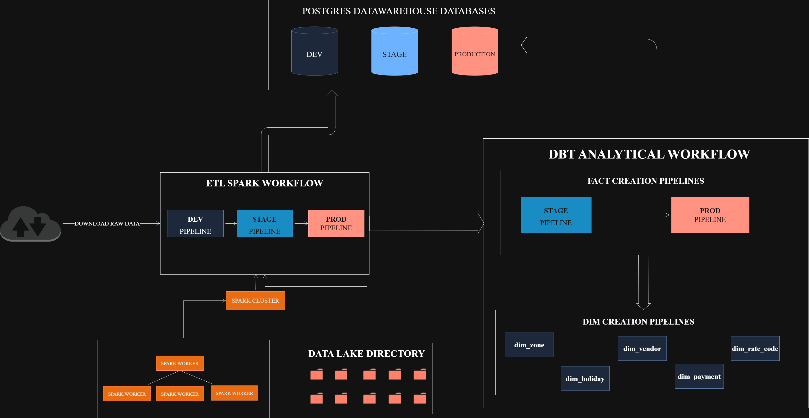

# **Two-Workflows Documentation**

## **Overview**  

The data pipeline consists of two interconnected workflows:  
1. **ETL Spark Pipeline** – Responsible for extracting, transforming, and loading raw taxi trip data.  
2. **DBT Analytical Workflow** – Processes the transformed data to generate structured fact and dimension tables.  

The diagram below illustrates how these workflows interact:  

---

## **Workflow Breakdown**  

### **1. ETL Spark Pipeline (Raw Data Processing)**  
The first stage involves extracting data from the **TLC website**, applying transformations, and persisting it at different stages of the **data lineage**:  
- **Dev → Stage → Production**  

Throughout this process, data is continuously stored in the **data warehouse** to ensure persistence and prevent data loss.  

#### **Key Steps:**  
✅ Downloads raw trip data from the **TLC API**.  
✅ Uses **Spark Clusters** to process large datasets efficiently.  
✅ Stores temporary data in the **Data Lake** to avoid memory issues.  
✅ Transforms and cleans data through multiple lineage stages.  
✅ Outputs **final cleaned data** into the **Production warehouse**.  

---

### **2. DBT Analytical Workflow (Data Warehouse Processing)**  
Once the ETL pipeline completes, the **DBT workflow** takes over to refine and organize the data for analytics.  

#### **Key Steps:**  

#### **(a) Staging Pipeline (Data Cleaning & Transformation)**  
🔹 Extracts the final **tripdata output** from the **Production ETL pipeline** into the **Stage database**.  
🔹 Performs **data cleaning** and **transformation** operations.  
🔹 Ensures **data quality** using **dbt schema tests** (`schema.yml`).  
🔹 Combines **Yellow, Green, and FHV trip datasets** into a **single fact table (`stg_fact_tripdata`)**.  
🔹 Loads `stg_fact_tripdata` into the **Stage Data Warehouse**.  

#### **(b) Production Pipeline (Final Data Loading)**  
🔹 Transfers the **stg_fact_tripdata** table to the **Production database**.  
🔹 Ensures final validation checks before making data **analytics-ready**.  

---

### **3. Dimension & Aggregation Pipelines**  
Once `fact_tripdata` exists in **Production**, we can trigger the **Dimension Pipeline** to generate reference and aggregated data.  

#### **Key Steps:**  
🔹 **Full-refresh dbt execution** to recompute **aggregated dimension tables**.  
🔹 Initializes **dbt seed data** (if not already set).  
🔹 Ensures all **reference mappings** (vendors, rate codes, payment types, etc.) are up-to-date.  
